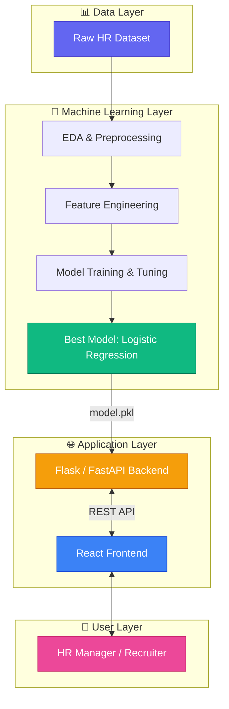
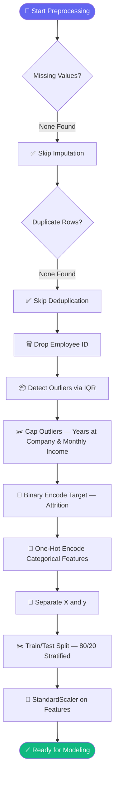
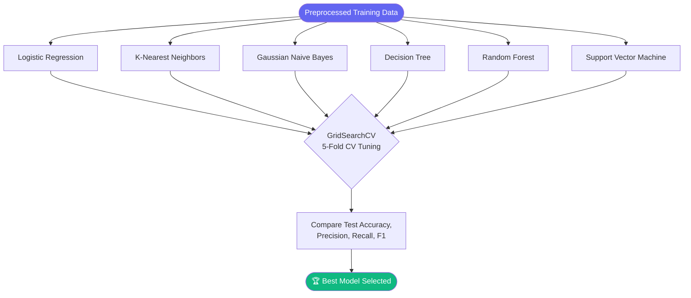
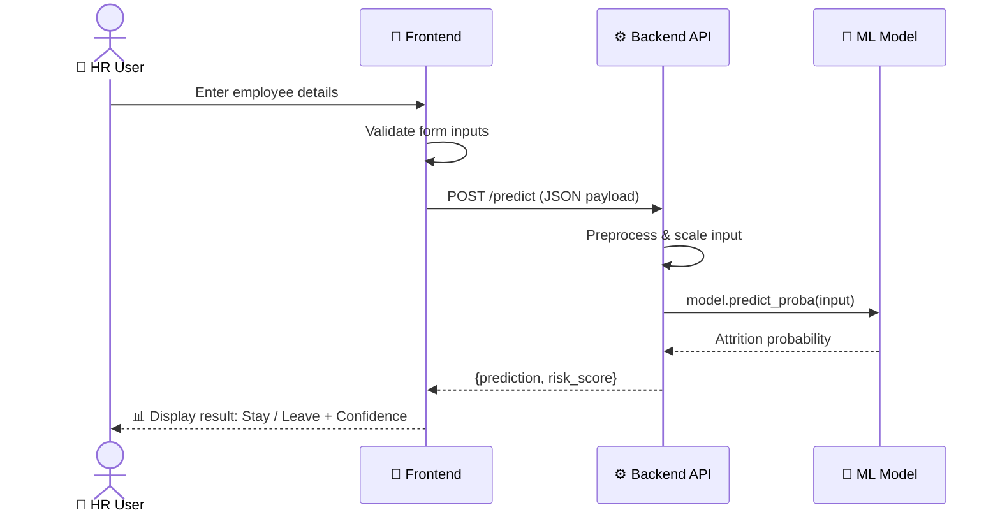
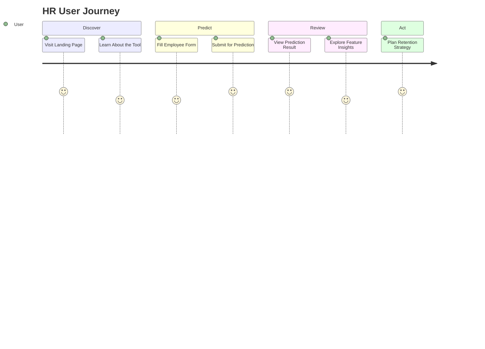
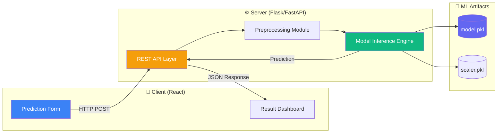
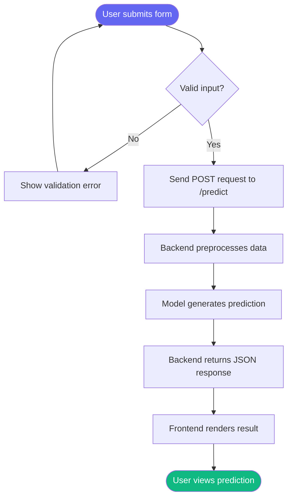
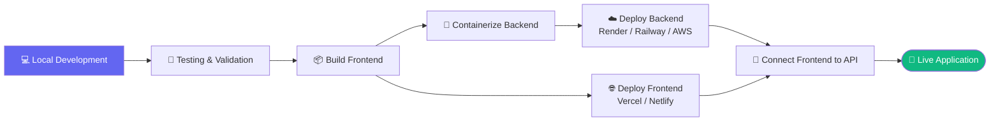
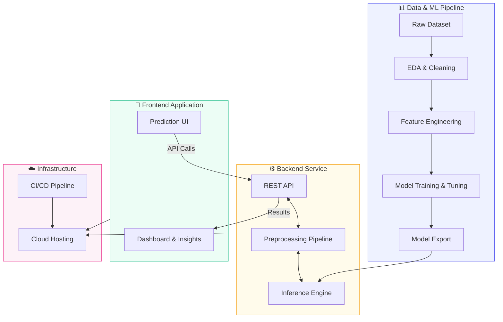

<div align="center">

# 🧠 Employee Attrition Prediction System
### *AI-Powered HR Analytics for Smarter Talent Retention*


<br/>

[](https://www.python.org/)
[](https://scikit-learn.org/)
[](https://pandas.pydata.org/)
[](https://reactjs.org/)
[](https://flask.palletsprojects.com/)
<br/>

### 🎯 Predicting whether an employee will **Stay** or **Leave** — before it happens.

<br/>

[🌐 Live Demo](https://hr-insight-ai-two.vercel.app/) • [📂 Notebook](https://YOUR-NOTEBOOK) • [💻 Frontend](https://github.com/Sneha8126/hr-insight-frontend) • [⚙️ Backend](https://github.com/Sneha8126/hr-insight-backend) 

</div>

<br/>

## 📚 Table of Contents

<details open>
<summary><b>Click to expand / collapse</b></summary>

1. [📖 Project Description](#-project-description)
2. [✨ Features](#-features)
3. [🤔 Why This Project?](#-why-this-project)
4. [❓ Problem Statement](#-problem-statement)
5. [📊 Dataset Information](#-dataset-information)
6. [🏗️ Project Architecture](#️-project-architecture)
7. [🔬 Machine Learning Pipeline](#-machine-learning-pipeline)
8. [🧹 Data Preprocessing Pipeline](#-data-preprocessing-pipeline)
9. [🛠️ Feature Engineering](#️-feature-engineering)
10. [📈 Exploratory Data Analysis (EDA)](#-exploratory-data-analysis-eda)
11. [🤖 Models Used](#-models-used)
12. [⚖️ Model Comparison](#️-model-comparison)
13. [📏 Evaluation Metrics](#-evaluation-metrics)
14. [🏆 Best Model](#-best-model)
15. [🔮 Prediction Workflow](#-prediction-workflow)
16. [📁 Folder Structure](#-folder-structure)
17. [⚙️ Installation Guide](#️-installation-guide)
18. [🚀 Usage Instructions](#-usage-instructions)
19. [🔌 API Endpoints](#-api-endpoints)
20. [🌐 Website Overview](#-website-overview)
21. [🖼️ Screenshots](#️-screenshots)
22. [🧰 Tech Stack](#-tech-stack)
23. [🔗 Project Links](#-project-links)
24. [🔭 Future Enhancements](#-future-enhancements)
25. [🤝 Contributing](#-contributing)
26. [📜 License](#-license)
27. [👩‍💻 Author](#-author)

</details>

---

## 📖 Project Description

The **Employee Attrition Prediction System** is an end-to-end **Machine Learning classification project** that predicts whether an employee is likely to **Stay (1)** or **Leave (0)** an organization, based on demographic, job-related, and workplace factors.

Employee attrition is one of the most costly and disruptive challenges HR departments face — it drives up recruitment costs, causes loss of institutional knowledge, and hurts team morale. This project tackles that problem head-on by building a **data-driven early-warning system** that flags at-risk employees so HR teams can act *before* they walk out the door.

The project spans the **entire ML lifecycle** — from raw data exploration and cleaning, through feature engineering, model training, hyperparameter tuning, and evaluation — and is wrapped in a **full-stack web application** that lets users interact with the trained model through a clean, modern interface.

> [!TIP]
> This repository is designed to be **portfolio-ready** — it demonstrates the complete workflow a Data Scientist / ML Engineer follows in a real-world project, from notebook to production-ready web app.

---

## ✨ Features

<table>
<tr>
<td width="50%">

### 🔬 Machine Learning
- ✅ 6 classification algorithms trained & compared
- ✅ Hyperparameter tuning with `GridSearchCV`
- ✅ IQR-based outlier treatment
- ✅ One-Hot Encoding for categorical features
- ✅ Feature scaling with `StandardScaler`
- ✅ 15+ insight-driven EDA visualizations
- ✅ Feature importance / model explainability

</td>
<td width="50%">

### 🌐 Full Stack Web App
- ✅ Interactive prediction interface
- ✅ Real-time attrition risk scoring
- ✅ REST API-powered backend
- ✅ Clean, responsive React frontend
- ✅ Visual model performance dashboard
- ✅ Deployment-ready architecture
- ✅ Modular, well-documented codebase

</td>
</tr>
</table>

---

## 🤔 Why This Project?

> [!NOTE]
> Losing an experienced employee doesn't just cost a paycheck — it costs onboarding time, lost productivity, team disruption, and irreplaceable institutional knowledge.

Most organizations react to attrition **after** an employee resigns. This project flips that model — it uses historical HR data to **proactively identify at-risk employees**, enabling HR teams to:

- 🎯 Prioritize retention efforts on high-risk employees
- 💰 Reduce recruitment & training costs
- 📊 Make data-backed HR policy decisions
- 🧭 Understand *which* factors truly drive attrition (compensation, workload, satisfaction, growth opportunities, etc.)

---

## ❓ Problem Statement

> Employee attrition is a significant challenge for organizations as it leads to increased recruitment costs, reduced productivity, and loss of experienced employees. This project analyzes employee demographic, job-related, and workplace factors to identify the key reasons behind attrition, and predicts whether an employee is likely to **Stay** or **Leave** the company. These insights help organizations improve employee retention and make informed HR decisions.

**Type:** Binary Classification &nbsp;|&nbsp; **Target Variable:** `Attrition` (`Stayed` = 1, `Left` = 0)

---

## 📊 Dataset Information

<div align="center">

| Attribute | Details |
|---|---|
| 📦 **Total Records** | 59,598 employees |
| 📐 **Total Columns** | 24 (23 features + 1 target) |
| 🎯 **Target Variable** | `Attrition` (Stayed / Left) |
| 🧩 **Data Types** | Mixed — Numerical & Categorical |
| 🕳️ **Missing Values** | None ✅ |
| 🔁 **Duplicate Records** | None ✅ |
| ⚖️ **Class Balance** | Reasonably balanced |

</div>

### 🗂️ Key Variables

| Variable | Description |
|---|---|
| `Employee ID` | Unique identifier (dropped before modeling) |
| `Age` | Age of the employee |
| `Gender` | Male / Female |
| `Years at Company` | Tenure in years |
| `Job Role` | Employee's designation |
| `Monthly Income` | Salary |
| `Work-Life Balance` | Poor / Fair / Good / Excellent |
| `Job Satisfaction` | Low / Medium / High / Very High |
| `Performance Rating` | Performance evaluation score |
| `Number of Promotions` | Total promotions received |
| `Overtime` | Yes / No |
| `Distance from Home` | Commute distance (km) |
| `Company Reputation` | Perceived reputation of the company |
| `Employee Recognition` | Recognition level received |
| `Remote Work` | Whether remote work is available |

> [!NOTE]
> The dataset was clean and complete — **zero missing values** and **zero duplicates** — allowing the project to focus heavily on **EDA, feature engineering, and model optimization** rather than data-cleaning overhead.

---

## 🏗️ Project Architecture



---

## 🔬 Machine Learning Pipeline


---

## 🧹 Data Preprocessing Pipeline



> [!TIP]
> **Outlier Handling:** Used the **IQR (Interquartile Range) capping / Winsorization** method on `Years at Company` and `Monthly Income` — this preserves all records while limiting the influence of extreme values, unlike outright deletion.

---

## 🛠️ Feature Engineering

<details>
<summary><b>📌 Click to view Feature Engineering details</b></summary>

<br/>

| Step | Technique | Purpose |
|---|---|---|
| **Target Encoding** | Binary Mapping (`Stayed`→1, `Left`→0) | Prepares target for binary classification |
| **Categorical Encoding** | One-Hot Encoding (`drop_first=True`) | Converts nominal categories to numeric, avoids ordinal bias |
| **Outlier Treatment** | IQR Capping | Limits extreme value influence without data loss |
| **Feature Scaling** | `StandardScaler` | Normalizes numeric ranges for distance-based & linear models |
| **Dimensionality Reduction** | Not applied | Feature count (41 post-encoding) was manageable; interpretability prioritized |

### 🌟 Most Influential Features (from Logistic Regression coefficients)

1. 💰 Monthly Income
2. 📅 Years at Company
3. 😊 Job Satisfaction
4. ⚖️ Work-Life Balance
5. ⏰ Overtime
6. 👔 Leadership Opportunities
7. 🏢 Company Reputation
8. 🏅 Employee Recognition
9. 📊 Performance Rating

</details>

---

## 📈 Exploratory Data Analysis (EDA)

A comprehensive EDA was performed following the **UBM Rule** — **U**nivariate, **B**ivariate, and **M**ultivariate analysis — resulting in **20+ visualizations** including:

<table>
<tr>
<td>🥧 Attrition Distribution (Pie Chart)</td>
<td>📦 Age vs Attrition (Box Plot)</td>
</tr>
<tr>
<td>👫 Gender vs Attrition</td>
<td>💍 Marital Status vs Attrition</td>
</tr>
<tr>
<td>🎓 Education Level vs Attrition</td>
<td>💵 Monthly Income vs Attrition</td>
</tr>
<tr>
<td>📈 Job Level vs Attrition & Income</td>
<td>🕐 Years at Company vs Attrition</td>
</tr>
<tr>
<td>🏅 Promotions vs Attrition</td>
<td>⏰ Overtime vs Attrition</td>
</tr>
<tr>
<td>⚖️ Work-Life Balance vs Attrition</td>
<td>😊 Job Satisfaction vs Attrition</td>
</tr>
<tr>
<td>🏠 Remote Work vs Attrition</td>
<td>🏢 Company Reputation vs Attrition</td>
</tr>
<tr>
<td>🏆 Employee Recognition vs Attrition</td>
<td>🚗 Distance from Home vs Attrition</td>
</tr>
<tr>
<td>🔥 Correlation Heatmap</td>
<td>🔗 Pair Plot of Numerical Features</td>
</tr>
</table>

### 🔑 Key Insights

- 📉 **Entry-level employees** show the highest attrition; **senior-level** employees show the strongest retention.
- 🏠 Employees **without remote work options** leave at noticeably higher rates.
- ⚖️ **Poor / Fair work-life balance** strongly correlates with higher attrition.
- 🏅 Employees with **more promotions** are far more likely to stay.
- ⏰ Employees working **overtime** show elevated attrition rates.
- 💰 Monthly income alone is **not** a strong differentiator between employees who stay vs. leave — retention is **multi-factorial**.

---

## 🤖 Models Used

The following **6 classification algorithms** were trained, evaluated, and tuned:

| # | Model | Type |
|---|---|---|
| 1️⃣ | **Logistic Regression** | Linear |
| 2️⃣ | **K-Nearest Neighbors (KNN)** | Distance-based |
| 3️⃣ | **Gaussian Naive Bayes** | Probabilistic |
| 4️⃣ | **Decision Tree** | Tree-based |
| 5️⃣ | **Random Forest** | Ensemble (Bagging) |
| 6️⃣ | **Support Vector Machine (SVM)** | Margin-based |

Each model was evaluated on **Training Accuracy, Testing Accuracy, Precision, Recall, F1-Score, Confusion Matrix**, and **Classification Report**, and each was further optimized using **GridSearchCV with 5-Fold Cross-Validation**.



---

## ⚖️ Model Comparison

<div align="center">

| Model | Train Acc. | Test Acc. | Precision | Recall | F1-Score | Overfitting? |
|---|:---:|:---:|:---:|:---:|:---:|:---:|
| **Logistic Regression** (Tuned) | 75.1% | **75.0%** | 75.9% | 76.6% | 76.3% | ✅ No |
| K-Nearest Neighbors (Tuned) | 100% | 69.8% | 72.2% | 69.0% | 70.6% | ⚠️ Yes |
| Gaussian Naive Bayes | 72.5% | 72.3% | 75.7% | 69.6% | 72.5% | ✅ No |
| Decision Tree (Tuned) | 75.5% | 72.5% | 74.8% | 71.7% | 73.2% | ✅ Minimal |
| Random Forest (Tuned) | 98.7% | 74.9% | — | — | — | ⚠️ Yes |
| **Support Vector Machine** | 80.7% | 74.8% | 75.9% | 76.2% | 76.0% | ✅ No |

</div>

> [!IMPORTANT]
> **Logistic Regression** achieved the **best generalization** — the smallest gap between training and testing accuracy — while matching or beating the ensemble models on test performance. This made it the ideal choice for a **stable, interpretable, production-ready** model.

---

## 📏 Evaluation Metrics

The following metrics were prioritized for their **business relevance**:

| Metric | Business Meaning |
|---|---|
| 🎯 **Accuracy** | Overall correctness of predictions |
| 🎯 **Precision** | Of employees predicted to leave, how many actually left — avoids wasted retention effort |
| 🚨 **Recall** | Of employees who actually left, how many were correctly flagged — **critical**, since missing a flight-risk employee is costly |
| ⚖️ **F1-Score** | Harmonic balance between Precision & Recall |
| 📉 **Confusion Matrix** | Breakdown of TP / TN / FP / FN for deeper diagnostic insight |

<details>
<summary><b>🖼️ View Confusion Matrix / ROC Curve placeholders</b></summary>

<br/>

<p align="center">
  
  
</p>

</details>

---

## 🏆 Best Model

<div align="center">

### 🥇 **Logistic Regression**

| Metric | Score |
|---|---|
| Test Accuracy | **~75%** |
| Precision | **75.9%** |
| Recall | **76.6%** |
| F1-Score | **76.3%** |
| Generalization Gap | **~0.1%** (excellent) |

</div>

**Why Logistic Regression?**

- ✅ Highest, most stable test accuracy among all 6 models
- ✅ Minimal gap between train and test performance (no overfitting)
- ✅ Balanced Precision, Recall, and F1-Score
- ✅ Computationally efficient and fast to serve in production
- ✅ Fully interpretable — coefficients map directly to feature importance
- ✅ Outputs calibrated probabilities, enabling **risk-scoring** rather than just binary labels

---

## 🔮 Prediction Workflow



---

## 📁 Folder Structure

```bash
employee-attrition-prediction/
│
├── 📂 ml-notebook/
│   ├── Employee_Attrition_Classification.ipynb   # Main ML notebook
│   ├── model.pkl                                 # Trained Logistic Regression model
│   ├── scaler.pkl                                # Fitted StandardScaler
│   ├── feature_columns.pkl                       # Ordered feature list for inference
│   └── train.csv                                 # Dataset
│
├── 📂 backend/
│   ├── app.py                                    # Flask/FastAPI entry point
│   ├── routes/
│   │   └── predict.py                            # /predict endpoint logic
│   ├── models/
│   │   └── model.pkl
│   ├── utils/
│   │   └── preprocess.py                         # Preprocessing helper functions
│   ├── requirements.txt
│   └── README.md
│
├── 📂 frontend/
│   ├── public/
│   ├── src/
│   │   ├── components/
│   │   │   ├── PredictionForm.jsx
│   │   │   ├── ResultCard.jsx
│   │   │   └── Navbar.jsx
│   │   ├── pages/
│   │   │   ├── Home.jsx
│   │   │   ├── Dashboard.jsx
│   │   │   └── Predict.jsx
│   │   ├── services/
│   │   │   └── api.js
│   │   ├── App.jsx
│   │   └── index.js
│   ├── package.json
│   └── README.md
│
├── 📂 assets/
│   └── screenshots/                              # README screenshots
│
├── .gitignore
├── LICENSE
└── README.md
```

---

## ⚙️ Installation Guide

### 📋 Prerequisites

- 🐍 Python 3.9+
- 📦 Node.js 16+ & npm/yarn
- 🔧 Git

### 📥 Clone the Repository

```bash
git clone (https://github.com/Sneha8126/Sneha-Sample-Classisfication--ML-Submission-Template).git
```

### 🐍 Set Up the ML / Notebook Environment

```bash
cd ml-notebook
python -m venv venv
source venv/bin/activate      # On Windows: venv\Scripts\activate
pip install -r requirements.txt
jupyter notebook
```

> [!WARNING]
> Ensure your dataset (`train.csv`) is placed in the correct path before running the notebook cells, or update the `pd.read_csv()` path accordingly.

---

## 🚀 Usage Instructions

1. Run the notebook end-to-end to reproduce EDA, preprocessing, training, and evaluation.
2. The final trained model is exported as `model.pkl`, along with `scaler.pkl` and `feature_columns.pkl`.
3. Start the backend server to expose the model via a REST API.
4. Start the frontend to interact with the model through a browser UI.
5. Enter employee attributes in the prediction form to get a **Stay / Leave** prediction with a confidence score.

---
## 🔌 API Endpoints

| Method | Endpoint | Description |
|---|---|---|
| `GET` | `/health` | Health check for the API service |
| `POST` | `/predict` | Accepts employee features, returns attrition prediction & probability |
| `GET` | `/model-info` | Returns metadata about the deployed model (version, metrics) |
| `GET` | `/feature-importance` | Returns top contributing features |

<details>
<summary><b>📦 Sample Request / Response</b></summary>

**Request** — `POST /predict`
```json
{
  "Age": 34,
  "Gender": "Female",
  "Years at Company": 5,
  "Monthly Income": 5200,
  "Job Satisfaction": "High",
  "Work-Life Balance": "Good",
  "Overtime": "No",
  "Number of Promotions": 1,
  "Remote Work": "Yes"
}
```

**Response**
```json
{
  "prediction": "Stayed",
  "probability": 0.82,
  "risk_level": "Low"
}
```

</details>

---

## 🌐 Website Overview

### 🎨 Frontend Overview
A responsive **React**-based single-page application offering an intuitive interface for HR personnel to input employee data and instantly receive attrition risk predictions, along with visual explanations of contributing factors.

### ⚙️ Backend Overview
A lightweight **Flask/FastAPI** REST service that wraps the trained ML pipeline (preprocessing + model) behind a clean API contract, making the model consumable by any client — web, mobile, or third-party HR systems.

### 🌟 Website Features
- 🏠 Landing page with project overview
- 📝 Interactive prediction form
- 📊 Real-time results with confidence scoring
- 📈 Model performance dashboard
- 🔍 Feature importance visualization
- 📱 Fully responsive design

### 🔄 Website Workflow


### 🖱️ Prediction Interface
Users fill out a guided, validated form covering demographic, job, and workplace attributes. On submission, the app displays a clear **Stay / Leave** verdict with a probability-based risk gauge.

### 🧭 User Journey



---

## 🏛️ Frontend → Backend → ML Model Architecture



---

## 🚦 User Request Flow



---

## 🚢 Deployment Workflow



---

## 🌍 Complete End-to-End System Architecture



---

## 🖼️ Screenshots

> [!NOTE]
> Add your actual screenshots to `assets/screenshots/` and update the image paths below.

<table>
<tr>
<td align="center"><b>🏠 Home Page</b><br/></td>
<td align="center"><b>📊 Dashboard</b><br/></td>
</tr>
<tr>
<td align="center"><b>📝 Prediction Page</b><br/></td>
<td align="center"><b>✅ Result Page</b><br/></td>
</tr>
<tr>
<td align="center"><b>📈 Model Performance</b><br/></td>
<td align="center"><b>🧮 Confusion Matrix</b><br/></td>
</tr>
<tr>
<td align="center"><b>📉 ROC Curve</b><br/></td>
<td align="center"><b>🌟 Feature Importance</b><br/></td>
</tr>
<tr>
<td align="center"><b>📊 EDA Visualizations</b><br/></td>
<td align="center"><b>🏗️ Architecture Diagram</b><br/></td>
</tr>
</table>

---

## 🧰 Tech Stack

<div align="center">

| Category | Technology |
|---|---|
| 🐍 **Language** |  |
| 🤖 **ML Framework** |  |
| 🐼 **Data Handling** |   |
| 📊 **Visualization** |   |
| ⚙️ **Backend** |  /  |
| 🎨 **Frontend** |     |
| 🔧 **Version Control** |   |

</div>

---

## 🔗 Project Links

<div align="center">

| Resource | Link |
|---|---|
| 🌐 **Live Website** | [https://YOUR-LIVE-LINK](https://hr-insight-ai-two.vercel.app/) |
| 💻 **Frontend Repository** | [https://YOUR-FRONTEND-REPOSITORY](https://github.com/Sneha8126/hr-insight-frontend) |
| ⚙️ **Backend Repository** | [https://YOUR-BACKEND-REPOSITORY](https://github.com/Sneha8126/hr-insight-backend) |
| 📂 **ML Notebook** | [https://YOUR-NOTEBOOK](https://YOUR-NOTEBOOK) |

</div>

---

## 🔭 Future Enhancements

- [ ] 🧠 Integrate **SHAP / LIME** for advanced model explainability
- [ ] 🌲 Experiment with **XGBoost / LightGBM / CatBoost** for potential performance gains
- [ ] 🗃️ Move from CSV-based storage to a proper **database** (PostgreSQL/MongoDB)
- [ ] 🔐 Add **authentication & role-based access** for HR dashboards
- [ ] 📱 Build a **mobile app** version of the prediction interface
- [ ] ☁️ Set up **CI/CD pipelines** for automated testing & deployment
- [ ] 📊 Add **batch prediction** support (CSV upload for bulk scoring)
- [ ] 🔔 Implement **automated alerts** for high-risk employees
- [ ] 🧪 Add **A/B testing** for retention strategy effectiveness

---

## 🤝 Contributing

Contributions are always welcome! 🎉

1. 🍴 Fork the repository
2. 🌿 Create your feature branch (`git checkout -b feature/AmazingFeature`)
3. 💾 Commit your changes (`git commit -m 'Add some AmazingFeature'`)
4. 📤 Push to the branch (`git push origin feature/AmazingFeature`)
5. 🔁 Open a Pull Request

> [!TIP]
> Please make sure to update tests and documentation as appropriate, and follow the existing code style.

---

## 📜 License

This project is licensed under the **MIT License** — see the [LICENSE](LICENSE) file for details.

```
MIT License © 2026 Sneha
Permission is hereby granted, free of charge, to any person obtaining a copy
of this software and associated documentation files to deal in the Software
without restriction, subject to the standard MIT License conditions.
```

---

## 👩‍💻 Author

<div align="center">

### **Sneha**
*CSE — Branch C | Machine Learning Enthusiast*

[](https://github.com/YOUR-USERNAME)
[](https://linkedin.com/in/YOUR-LINKEDIN)
[](mailto:YOUR-EMAIL@example.com)

<br/>

⭐ **If you found this project helpful, consider giving it a star!** ⭐

</div>

---

<div align="center">
<sub>Built with 🧠 Machine Learning, ⚙️ Engineering rigor, and ☕ lots of coffee.</sub>
</div>
